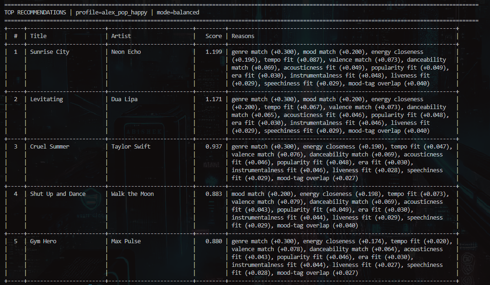
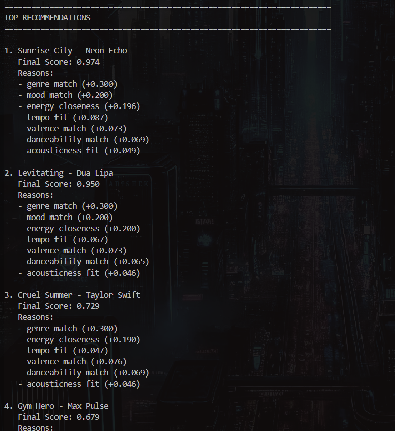
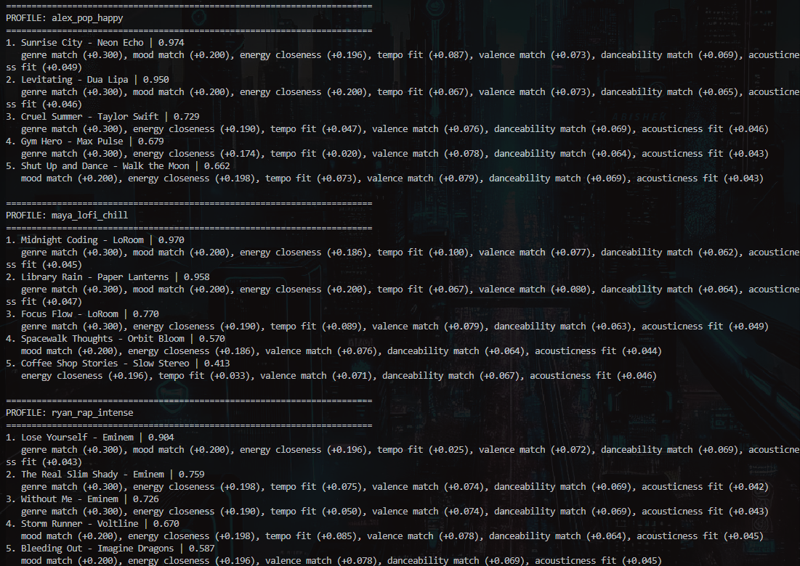
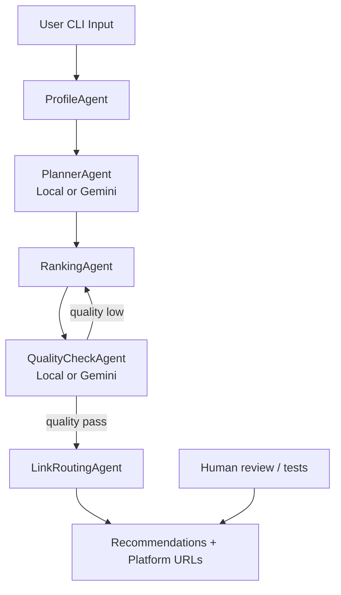

# 🎵 Music Recommender Simulation

## Project Summary

This project builds a small rule-based music recommender.  
It compares song features with a user taste profile and ranks songs by match score.  
The system then returns the top 5 recommendations and a short explanation for each score.  
The goal is to study how recommendation logic works in a controlled classroom setting.  

---

## How Real-World Recommenders Work

Real apps like Spotify and YouTube combine many data signals.  
They use content features (genre, mood, tempo), user behavior (plays, skips, likes), and listening history (recent and long-term).  

This project mirrors that structure in a simplified form:

- Input data: song attributes from the dataset.
- User preferences: a profile with favorite genre, mood, and target audio values.
- Ranking and selection: a scoring function ranks songs, and the top results are returned.

This is a rule-based simulation, not a trained machine learning model.

---

## How The System Works

The recommender uses a `Song` object with these features:

- Categorical features: genre and mood
- Numeric features: energy, valence, danceability, acousticness, and tempo (BPM)
- Added attributes: popularity (0-100), release year, release decade, instrumentalness, liveness, speechiness, and detailed mood tags
- Metadata: id, title, and artist

The `UserProfile` stores a target taste, such as favorite genre, favorite mood, target energy, target valence, target danceability, and tempo preference.

For each song, the recommender computes a weighted similarity score.  
Exact matches on genre and mood add strong positive weight.  
Numeric features add partial points based on closeness to the user targets.  
The score also uses popularity, era fit, instrumentalness, liveness, speechiness, and mood-tag overlap.  
After base scoring, a diversity reranker applies an artist repetition penalty to reduce filter bubbles.  
The system then returns the top 5 results.

### Ranking Modes

The app supports multiple modular ranking strategies:

- `balanced` (default)
- `genre_first`
- `mood_first`
- `energy_similarity`

You can switch modes in `src/main.py` using `active_ranking_mode`.

### How To Change Mode and Profile

Open `src/main.py` and update these two variables inside `main()`:

- `active_profile_name` controls which user taste profile is used.
- `active_ranking_mode` controls which ranking strategy is used.

Example:

```python
active_profile_name = "maya_lofi_chill"
active_ranking_mode = "mood_first"
```

Available profile keys:

- `alex_pop_happy`
- `maya_lofi_chill`
- `ryan_rap_intense`

Available ranking modes:

- `balanced`
- `genre_first`
- `mood_first`
- `energy_similarity`
- 


After changing values, run:

```bash
uv run python src/main.py
```

## Output Showing Recommendations

### Single Profile:


### Multiple Profile:


The multi-profile screenshot includes `alex_pop_happy`, `maya_lofi_chill`, and `ryan_rap_intense`.

The terminal now renders a formatted ASCII table with rank, title, artist, final score, and reason text for transparency.

### Top-3 Explanation Examples

Examples from a run for `alex_pop_happy`:

- Sunrise City: `genre match + mood match + high energy closeness + tempo fit`
- Levitating: `genre match + mood match + strong danceability + valence match`
- Cruel Summer: `genre match + energy closeness + valence match`

These explanations come directly from the scoring components.

---

## Getting Started

### Setup

1. Install dependencies

```bash
uv sync
```

2. Run the app:

```bash
uv run python src/main.py
```

### Agentic Workflow CLI

The CLI now runs an agentic pipeline with three stages:

- `ProfileAgent`: validates and loads a user profile
- `PlannerAgent`: selects ranking strategy and tuning settings (local logic or Gemini)
- `RankingAgent`: scores and ranks songs using the configured ranking mode
- `QualityCheckAgent`: checks recommendation quality and can trigger one retry
- `LinkRoutingAgent`: generates links for each recommendation across music platforms

### Real LLM Agent (Gemini)

This project supports a real model-backed agent using Gemini via API.

Set your API key:

```bash
# PowerShell
$env:GEMINI_API_KEY="your_api_key_here"
```

Run with Gemini planner/checker enabled:

```bash
uv run python main.py --mode auto --use-gemini --show-agent-log
```

What changes when Gemini is enabled:

- Planner agent proposes `selected_mode`, `selected_top_k`, and `selected_artist_penalty`
- Checker agent evaluates quality and confidence
- If quality is low, workflow retries once with checker-suggested settings
- Agent diagnostics are printed with `--show-agent-log`

If no API key is present, the app safely falls back to deterministic local planning/checking.

Example run with custom profile, mode, and platforms:

```bash
uv run python main.py --profile maya_lofi_chill --mode mood_first --top-k 5 --platforms spotify,youtube_music,apple_music,deezer,soundcloud
```

Open a recommendation directly in browser (interactive prompt):

```bash
uv run python main.py --open-browser
```

### System Diagram



Supported platform keys:

- `spotify`
- `youtube_music`
- `apple_music`
- `deezer`
- `soundcloud`

### Running Tests

Run the starter tests with:

```bash
uv run pytest
```

You can add more tests in `tests/test_recommender.py`.

---

## Experiments You Tried

I tested several scoring adjustments to observe behavior changes.

- Lowered genre weight from 2.0 to 0.5:
Cross-genre songs appeared more often. This increased diversity, but reduced alignment with user intent.

- Added tempo and valence in scoring:
Tempo improved precision for users with clear BPM preferences. Valence helped better match emotional tone.

- Compared multiple user profiles:
`alex_pop_happy` received strong mainstream matches. `maya_lofi_chill` and `ryan_rap_intense` had good top results but less variety due to catalog limits.

Comment on output differences:

- The pop profile favored high-valence, danceable songs.
- The lofi profile shifted toward lower energy and higher acousticness.
- The rap profile favored high-energy, high-tempo, intense tracks.
  
---

## Limitations and Risks

This recommender has important limitations:

- The catalog is very small (30 songs), so coverage is limited.
- The model does not use lyrics, language, release era, or listening history.
- Strong genre and mood matching can create filter bubbles.
- Popular genres receive more variety than niche genres.

These issues can reduce fairness and discovery for some users. A full analysis is included in the model card.
  
---

## Reflection

Building this project showed me how recommenders turn user preferences into numeric decisions. Even a simple weighted formula can produce results that feel accurate at first. I also learned that each feature weight acts like a product decision. A stronger weight can improve precision for one user while reducing variety for another.

I also saw how bias can appear without harmful intent. When a catalog is uneven, users in underrepresented genres get fewer and more repetitive suggestions. The system appears neutral, but it still favors users whose tastes match the largest part of the dataset. This made it clear that fairness, diversity, and transparency are essential parts of recommender design.

Read and complete `model_card.md`:

[**Model Card**](model_card.md)

---

