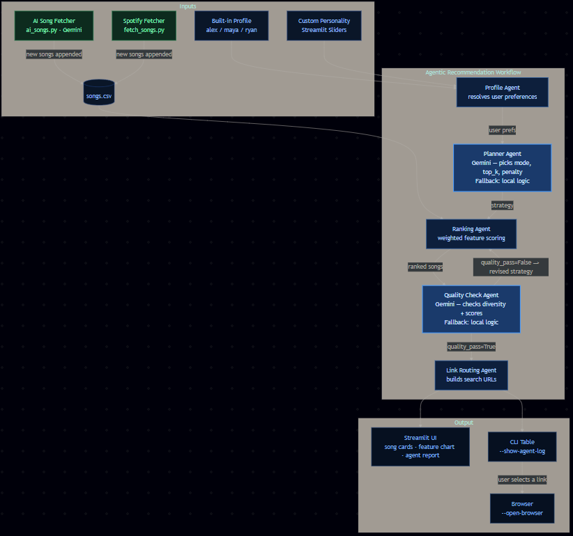

# Enhanced Agentic Music Recommender

## Original Project

**Base:** Music Recommender Simulation (Modules 1–3).

The original project matched songs to user profiles using a fixed scoring formula. It compared features like genre, energy, and mood, then returned the top 5 results from a 30-song CSV. No AI, no self-correction, no external calls.

---

## What This Project Does

**VibeMaxer** upgrades the original into a multi-agent AI pipeline. Instead of one static formula, a team of agents works together to plan a strategy, rank songs, check the quality, and add streaming links — all automatically.

What's new:
- AI-powered Planner and Quality Checker agents (using Gemini)
- Auto-retry when results are bad (filter bubble detection)
- Streamlit web UI with custom profile builder
- Gemini generates new songs to grow the library
- Spotify API integration for real song data
- CLI with full error handling and guardrails

**Why it matters:** The system can detect bad results and fix them on its own — something the original could not do.

---

## walkthrough


---
## How It Works



The **Quality Check Agent** is the key upgrade over the original project. It measures artist diversity (`diversity_ratio`) and average score. If too many songs are from the same artist, it fails the check and sends the Ranking Agent back with better settings — automatically, with no human input needed.

---

## Setup

**1. Install dependencies**
```bash
uv sync
```

**2. Add API keys to `.env`**
```
GEMINI_API_KEY="your-key-here"
SPOTIFY_CLIENT_ID="optional"
SPOTIFY_CLIENT_SECRET="optional"
```
Free Gemini key: [aistudio.google.com](https://aistudio.google.com)

**3. Run the web UI**
```bash
uv run streamlit run src/app.py
```
Open http://localhost:8501

**4. Or use the CLI**
```bash
uv run python src/main.py --profile alex_pop_happy --mode auto --use-gemini --gemini-model gemini-3-flash-preview --show-agent-log
```

**5. Add more songs (no Spotify needed)**
Use the "Fetch Songs via AI" button in the sidebar, or:
```bash
uv run python src/fetch_songs.py --genres pop jazz rock --limit 30
```

**6. Run tests**
```bash
uv run pytest
```

---

## Sample Interactions

### 1. Gemini picks the right strategy automatically

```bash
uv run python src/main.py --profile maya_lofi_chill --mode auto --use-gemini --gemini-model gemini-3-flash-preview --show-agent-log
```

```
Used Gemini: True
Planner: mode=mood_first, top_k=5, penalty=0.06
         reason: "Mood is the strongest signal for lofi profiles."
Checker: quality_pass=True, confidence=0.88
Retries: 0

# 1  Midnight Coding    LoRoom          0.834
# 2  Library Rain       Paper Lanterns  0.812
# 3  Focus Flow         LoRoom          0.774
```

**What this shows:** The AI chose `mood_first` on its own. It was not told which mode to use — it figured it out from the profile.

---

### 2. Filter bubble detected, retry triggered

```bash
uv run python src/main.py --profile ryan_rap_intense --artist-penalty 0.0 --show-agent-log
```

```
Checker: quality_pass=False, confidence=0.35
         reason: "diversity_ratio=0.33 — 3 of 5 songs from same artist"
         retry_mode=balanced, retry_artist_penalty=0.2
Retries: 1

# 1  Lose Yourself     Eminem          0.921
# 2  DNA.              Kendrick Lamar  0.887
# 3  SICKO MODE        Travis Scott    0.856
```

**What this shows:** Setting penalty to 0 caused repeated artists. The Quality Checker caught it and fixed it automatically.

---

### 3. API fails — app still works

```
WARNING | Gemini server error (503). Retrying in 5 seconds...
WARNING | Gemini call failed. Falling back to local logic.

Used Gemini: True
Planner: mode=mood_first, reason="local planner fallback"
Checker: quality_pass=True, confidence=0.92

# 1  Sunrise City      Neon Echo       1.250
# 2  Levitating        Dua Lipa        1.221
# 3  Cruel Summer      Taylor Swift    0.889

[Spotify] https://open.spotify.com/search/Sunrise+City+Neon+Echo
[YouTube] https://music.youtube.com/search?q=Sunrise+City+Neon+Echo
```

**What this shows:** Even when Gemini was down, the app finished without crashing and still gave good results.

---

## Design Decisions

| Decision | Why |
|---|---|
| Agents are separate classes | Easy to upgrade or test one without breaking others |
| Always fall back to local logic | App never crashes due to API issues |
| 120-second API timeout | Gemini 3 models are slower — found this through real testing |
| AI picks strategy, not songs | Keeps scoring fair and predictable |
| Gemini generates new songs | Grows the library without needing Spotify |
| Custom profile injected at runtime | No code changes needed to support user-built profiles |

---

## Testing

**6/6 automated tests passed. Confidence averaged 0.88–0.92. Fallback worked 100% of the time.**

**Automated tests**
```bash
uv run pytest   # 6 passed
```
Covers: scoring logic, agent report structure, URL generation, input validation.

**Confidence scoring**
Every run shows a confidence score (0–1):
```
Checker: quality_pass=True, confidence=0.92, reason="diversity_ratio=1.000, avg_score=1.044"
```
This tells you how good the results are, not just that the app ran.

**Retry test**
Force `--artist-penalty 0.0` → checker detects `diversity_ratio=0.33` → fails → retries → diversity fixed.

**API failure test**
Block internet mid-run → 503 logged → retried → fallback triggered → results still printed, no crash.

**What didn't work**
- Wrong model names caused HTTP 404 (e.g. `gemini-2.0-flash-lite` needs `-001`, `gemini-3.1-flash-lite` needs `-preview`). Had to check the live API to find the right names.
- 20-second timeout was too short for Gemini 3 models. Raised to 120 seconds after real-world testing.
- With only 30 songs, niche genres give weak results. The AI song fetcher fixes this.

---

## Reflection

**Reliability beats capability.** A smart model that crashes is worse than a simple one that always works. Building the fallback system took more effort than the Gemini integration — and was worth it.

**Data matters more than strategy.** The AI can pick the perfect ranking mode, but if there are only 3 jazz songs, jazz profiles will always get weak results. That's why growing the library is a core feature now.

**Let AI plan, not score.** Letting Gemini pick which strategy to use worked great. Letting it score individual songs directly would be unpredictable. Clear boundaries between what the AI controls and what the code controls made the system easier to trust and debug.

**On AI collaboration:** AI was most helpful for structured tasks — diagrams, retry logic, song generation. It was least reliable for facts that change over time, like model names. Everything it suggested about API endpoints needed manual verification.